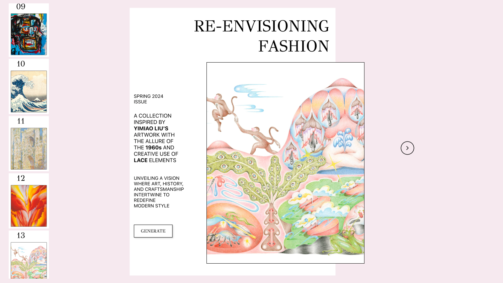
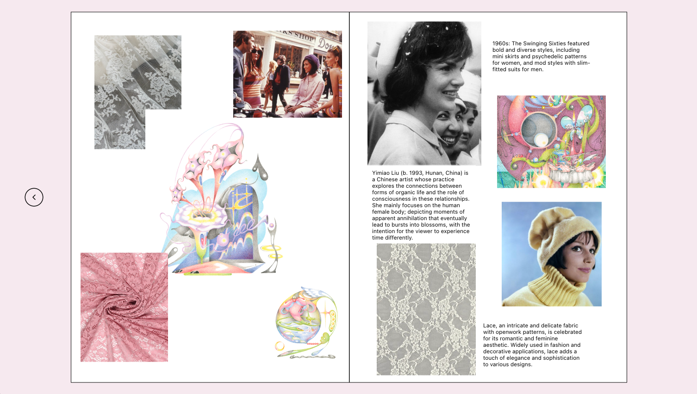

## Re-envisioning Fashion Concept Generator

Open [https://re-envisioning-fashion.vercel.app/](https://re-envisioning-fashion.vercel.app/) to view the app!

 I wanted to create an app that would generate a theme for a clothing collection and display a mood board to go along with the output. My goal was to create a generator that would inspire an idea for a new fashion collection. I designed the site based off of a magazine cover and wanted it to have the feel of a virtual catalog. 

## Features
<ul>
  <li>Press the generate button on the cover to generate a random collection. </li>
  <li>The arrow button on the right will open up the mood board that will provide images based on the generated prompt. </li>
  <li>You can view previously generated collections by clicking any cover on the left hand panel.  </li>
</ul>